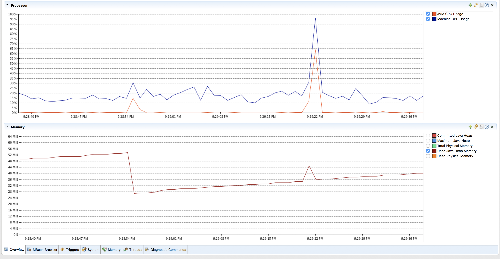

chat-server
------------

- API
- Schema

```bash
sbt clean assembly
```

run locally

```bash
java -jar chatServerApi/target/scala-2.12/chatServerApi.jar
Apr 26, 2018 11:33:39 PM com.twitter.finagle.Init$ $anonfun$once$1
INFO: Finagle version 18.3.0 (rev=87424ce8cee3075f9140082a0f91b4a3256a1f50) built at 20180306-113908
Apr 26, 2018 11:33:39 PM com.twitter.finagle.util.DefaultTimer$ <init>
WARNING: Can not service-load a timer. Using JavaTimer instead.

```

run using docker
----------------

```bash
sbt assembly; docker build -t chat-server .

docker run -e environment=stage -p 9090:9090 --name chat-server chat-server
```

```
curl -v -H "x-correlation-id: 12345678" -H "x-version: 1.0" localhost:9090/chat/init
{"correlationID":"94da2874-956e-4f3a-acb6-850df37adbb9","message":"Hi, How can I help you?"}
```

coffee intent
-------------

```bash
curl -v -H "x-user: prayagupd" -H "x-client-version: 1.0" -d '{"correlationID": "9c327ed6-05ad-4df6-beab-875c33906aab", "message": "coffee near me"}' localhost:9090/api/chat
*   Trying ::1...
* TCP_NODELAY set
* Connected to localhost (::1) port 9090 (#0)
> POST /chat HTTP/1.1
> Host: localhost:9090
> User-Agent: curl/7.54.0
> Accept: */*
> x-user: prayagupd
> x-client-version: 1.0
> Content-Length: 86
> Content-Type: application/x-www-form-urlencoded
>
* upload completely sent off: 86 out of 86 bytes
< HTTP/1.1 200 OK
< Date: Fri, 27 Apr 2018 05:41:15 GMT
< Server: Finch
< Content-Length: 94
< Content-Type: application/json
<
* Connection #0 to host localhost left intact
{"correlationID":"9c327ed6-05ad-4df6-beab-875c33906aab","displayText":"Here are coffee shops"}
```

un-recognised intent
--------------------

```bash
curl -H "x-user: prayagupd" -H "x-client-version: 1.0" -d '{"correlationID": "9c327ed6-05ad-4df6-beab-875c33906aab", "message": "can i know about renters insurance"}' localhost:9090/chat
{"correlationID":"9c327ed6-05ad-4df6-beab-875c33906aab","displayText":"Did not understand you"}
```

```
curl -v --request GET localhost:9090/chat/history?abc=1
```

Perf
----

```
ab -c 50 -n 1000 --request POST -H "x-user: prayagupd" -H "x-client-version: upd" -H "application/json" -p chat_request.json localhost:9090/api/chat
```


```
ab -c 10 -n 1000 -H "x-user: prayagupd" -H "x-client-version: upd" -T "application/json" -p chat_request.json localhost:9090/api/chat
This is ApacheBench, Version 2.3 <$Revision: 1826891 $>
Copyright 1996 Adam Twiss, Zeus Technology Ltd, http://www.zeustech.net/
Licensed to The Apache Software Foundation, http://www.apache.org/

Benchmarking localhost (be patient)
Completed 100 requests
Completed 200 requests
Completed 300 requests
Completed 400 requests
Completed 500 requests
Completed 600 requests
Completed 700 requests
Completed 800 requests
Completed 900 requests
Completed 1000 requests
Finished 1000 requests


Server Software:        Finch
Server Hostname:        localhost
Server Port:            9090

Document Path:          /api/chat
Document Length:        110 bytes

Concurrency Level:      10
Time taken for tests:   1.064 seconds
Complete requests:      1000
Failed requests:        0
Total transferred:      253000 bytes
Total body sent:        271000
HTML transferred:       110000 bytes
Requests per second:    940.13 [#/sec] (mean)
Time per request:       10.637 [ms] (mean)
Time per request:       1.064 [ms] (mean, across all concurrent requests)
Transfer rate:          232.28 [Kbytes/sec] received
                        248.80 kb/s sent
                        481.08 kb/s total

Connection Times (ms)
              min  mean[+/-sd] median   max
Connect:        0    1   1.6      1       9
Processing:     3    9   4.5      8      35
Waiting:        1    8   4.5      7      34
Total:          4   10   4.5      9      36

Percentage of the requests served within a certain time (ms)
  50%      9
  66%     11
  75%     12
  80%     13
  90%     16
  95%     19
  98%     22
  99%     25
 100%     36 (longest request)

```




100K
----

```
ab -c 100 -n 100000 -H "x-user: prayagupd" -H "x-client-version: upd" -T "application/json" -p chat_request.json localhost:9090/api/chat
This is ApacheBench, Version 2.3 <$Revision: 1826891 $>
Copyright 1996 Adam Twiss, Zeus Technology Ltd, http://www.zeustech.net/
Licensed to The Apache Software Foundation, http://www.apache.org/

Benchmarking localhost (be patient)
Completed 10000 requests
Completed 20000 requests
Completed 30000 requests
Completed 40000 requests
Completed 50000 requests
Completed 60000 requests
Completed 70000 requests
Completed 80000 requests
Completed 90000 requests
Completed 100000 requests
Finished 100000 requests


Server Software:        Finch
Server Hostname:        localhost
Server Port:            9090

Document Path:          /api/chat
Document Length:        110 bytes

Concurrency Level:      100
Time taken for tests:   236.887 seconds
Complete requests:      100000
Failed requests:        0
Total transferred:      25300000 bytes
Total body sent:        27100000
HTML transferred:       11000000 bytes
Requests per second:    422.14 [#/sec] (mean)
Time per request:       236.887 [ms] (mean)
Time per request:       2.369 [ms] (mean, across all concurrent requests)
Transfer rate:          104.30 [Kbytes/sec] received
                        111.72 kb/s sent
                        216.02 kb/s total

Connection Times (ms)
              min  mean[+/-sd] median   max
Connect:        0  164 1409.0     45   23071
Processing:     0   69 101.9     52    1671
Waiting:        0   53  86.8     40    1651
Total:          1  233 1411.0     97   23113

Percentage of the requests served within a certain time (ms)
  50%     97
  66%    119
  75%    135
  80%    145
  90%    189
  95%    292
  98%    739
  99%   1321
 100%  23113 (longest request)
```

TODOs
-----

1) pass in app properties like `-environment=dev` jar running inside docker

2) version docker images

~~2) add typesafe config to read intent-names~~

~~3) expose client-api as a `chat-server-client.jar` (to maven not ivy), make sure it can be used as sbt deps - https://github.com/duwamish-os/chat-server-api-client~~

4) provide http-client

5) logging

6) **add swagger**

7) Websocket - https://github.com/finagle/finagle-websocket

8) don't create jar for root
